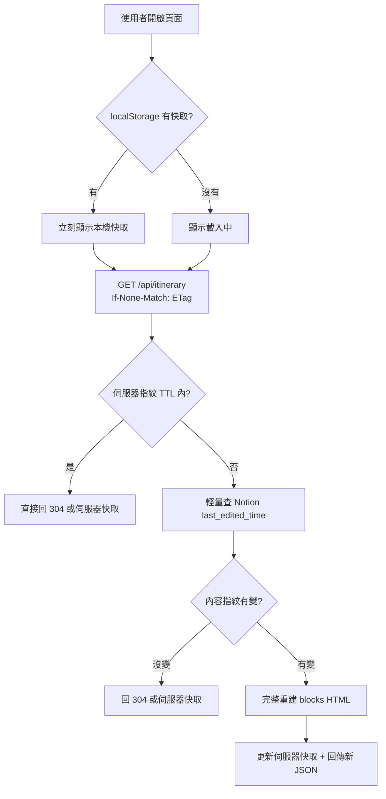

# 行程快取策略

本文件說明 Trip Flow 如何在不影響使用體驗的前提下，盡量減少 Notion API 呼叫與網路流量。此策略主要針對「旅行期間行程幾乎不變、同行旅伴反覆開啟頁面」的使用情境設計。

## 設計目標

- Notion 有更新時，才重新組裝完整行程資料
- 沒有更新時，前端與後端都盡量沿用快取
- 降低 Zeabur 等平台的 egress 流量與 Notion API 用量
- 保留手動強制更新能力（「重新渲染」按鈕）

## 三層快取架構



### 第一層：前端本機快取（localStorage）

| 項目 | 說明 |
|------|------|
| 實作檔案 | `src/lib/itineraryCache.ts`、`src/App.tsx` |
| 儲存鍵 | `trip-flow:itinerary:v1` |
| 儲存內容 | `etag`、`items`、`meta`、`savedAt` |
| 行為 | 有快取時先顯示舊資料，背景再向 API 確認是否有更新 |

流程：

1. 頁面載入時讀取 `localStorage`
2. 若有快取，立即渲染畫面（不需等待 API）
3. 背景發送 `GET /api/itinerary`，並帶上 `If-None-Match: <etag>`
4. 若收到 `304 Not Modified`，沿用本機快取
5. 若收到 `200 OK`，更新本機快取

### 第二層：伺服器 ETag / 304

| 項目 | 說明 |
|------|------|
| 實作檔案 | `server/itinerary.ts`、`server/itineraryCache.ts` |
| 指紋來源 | 所有 linked flow page 的 `last_edited_time`，以及 details page（若有）的 `last_edited_time` |
| ETag 格式 | SHA-256 前 16 字元，例如 `"c82b1136861c95e2"` |
| 回應標頭 | `ETag`、`Cache-Control: private, max-age=...` |

指紋計算方式：

```
pageId1:last_edited_time1
pageId2:last_edited_time2
...
```

各筆以換行串接、排序後再 hash，確保 Notion 任一相關頁面有變動時，ETag 就會改變。

當客戶端帶的 `If-None-Match` 與伺服器 ETag 相同時，伺服器回 `304 Not Modified`，**不回傳 JSON body**，大幅節省下載流量。

### 第三層：伺服器記憶體快取 + 指紋 TTL

| 項目 | 說明 |
|------|------|
| 實作檔案 | `server/itineraryCache.ts` |
| 快取內容 | 完整 itinerary JSON payload |
| TTL 控制 | `ITINERARY_FINGERPRINT_TTL` |

在 TTL 期間內，即使收到 API 請求，伺服器也**不會再去問 Notion**，直接回傳記憶體快取或 `304`。

完整重建（最耗資源的操作）只有在以下情況才會發生：

- 指紋 TTL 過期，且 Notion `last_edited_time` 有變化
- 使用者手動按「重新渲染」，帶 `?refresh=1` 強制略過快取

完整重建包含：

- 查詢 flow database 所有頁面
- 對每張卡抓取 Notion blocks 並轉成 HTML

## API 行為

### 一般請求

```http
GET /api/itinerary
If-None-Match: "c82b1136861c95e2"
```

可能回應：

| 狀態碼 | 意義 | body |
|--------|------|------|
| `304` | 內容未變更 | 空 |
| `200` | 有新資料或伺服器快取命中 | 完整 JSON |

成功回應的 JSON 結構：

```json
{
  "ok": true,
  "items": [ ... ],
  "meta": {
    "fetchedAt": "2026-06-05T07:39:52.000Z",
    "tripStart": "2026-07-16",
    "tripEnd": "2026-07-23",
    "cached": true
  }
}
```

`meta.cached: true` 表示此次回應來自伺服器快取，而非重新向 Notion 抓取 blocks。

### 強制更新

```http
GET /api/itinerary?refresh=1
```

- 略過指紋 TTL 與 ETag 快取
- 一定會重新查 Notion 並嘗試完整重建
- 對應前端「重新渲染（抓最新 Notion）」按鈕

## 環境變數

| 變數 | 預設值 | 說明 |
|------|--------|------|
| `ITINERARY_CACHE_MAX_AGE` | `86400`（1 天） | 回應標頭 `Cache-Control: max-age` 秒數，建議瀏覽器/客戶端快取時間 |
| `ITINERARY_FINGERPRINT_TTL` | `3600`（1 小時） | 伺服器多久才重新向 Notion 確認 `last_edited_time`；TTL 內完全不查 Notion |

### 旅行期間建議設定

若行程在旅行期間幾乎不會修改，可在 Zeabur 環境變數設為：

```bash
ITINERARY_CACHE_MAX_AGE=86400
ITINERARY_FINGERPRINT_TTL=86400
```

若確定整趟旅程都不會改，可設更長，例如 `604800`（7 天）。

## 各情境的資源消耗

| 情境 | Notion API | 下載流量 |
|------|-----------|---------|
| 第一次載入 | 完整查詢 + blocks 渲染 | 完整 JSON |
| 同 session 再開，內容沒變，TTL 內 | 不打 | `304`，幾乎為 0 |
| TTL 過了但 Notion 沒改 | 輕量查 `last_edited_time` | `304` 或小 JSON |
| Notion 有改 | 完整重建 | 新 JSON |
| 按「重新渲染」 | 強制完整重建 | 新 JSON |

## 前端提示訊息

畫面上方會顯示目前快取狀態，例如：

- `已使用本機快取，正在確認是否有更新…`
- `內容未變更，沿用快取`
- `內容未變更，沿用伺服器快取`
- `已更新為最新行程`

## 相關程式碼位置

| 檔案 | 職責 |
|------|------|
| `server/itineraryCache.ts` | 伺服器記憶體快取、ETag、指紋 TTL |
| `server/itinerary.ts` | API 入口、指紋比對、304 回應、完整重建 |
| `src/lib/itineraryCache.ts` | 前端 localStorage 讀寫 |
| `src/App.tsx` | 先顯示本機快取、帶 `If-None-Match`、處理 304 |

## 部署注意事項（Zeabur）

- 目前伺服器快取為**程序記憶體**（in-memory），適合單實例部署
- 若未來擴展為多實例，各實例快取獨立，可能短時間內出現不一致；屆時可考慮 Redis 等共享快取
- 前端 localStorage 快取與伺服器快取互不衝突，兩者疊加可進一步降低流量

## 已知限制

- 指紋依賴 Notion 的 `last_edited_time`；若 Notion 行為異常導致時間未更新，可能短暫沿用舊快取
- localStorage 在隱私模式或容量不足時可能寫入失敗，此時仍可依賴伺服器 ETag / 304
- `?refresh=1` 是刻意設計的逃生口，用於手動取得最新資料

## 未來可優化方向

若需進一步減少輪詢，可接入 **Notion Webhook**：

1. Notion 資料庫有變更時，通知伺服器
2. 伺服器清除快取
3. 平時完全不主動查 Notion，只在 webhook 觸發後才重建

此方案適合「極致省流量」且願意額外設定 Notion integration webhook 的情境。
